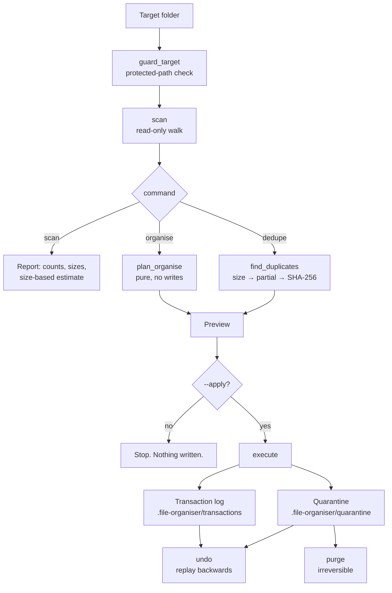

# file-organiser

> A safe file-management engine: scan a folder, organise it by type and date, and remove duplicate files verified by content — with a preview before anything happens and an undo for after it did.

[](https://github.com/Prithv122/file-organiser/actions/workflows/ci.yml)

**Live demo:** not deployed — a local CLI by design; it operates on your filesystem.
**Stack:** Python 3.13, Typer, Rich, stdlib `hashlib`/`pathlib`. No runtime dependencies beyond the CLI layer.

---

## 1. The problem

Folders like `Downloads` accumulate thousands of files and many gigabytes of redundant copies. The tools that clean them up have a bad reputation for a specific reason: they are destructive, they act on weak evidence, and when they get it wrong there is no way back.

The three failure modes that make people distrust this category of tool are:

1. **Deleting on weak evidence.** Matching on filename or file size flags `report.pdf` and `report.pdf` as duplicates when they are different documents.
2. **Silent overwrites.** Moving `Downloads/report.pdf` into `documents/` when a different `report.pdf` already lives there destroys one of them.
3. **No way back.** A dry-run flag prevents mistakes you predicted. It does nothing for the ones you did not.

This tool is built around the position that a file manager's correctness guarantees matter more than its feature count. Every destructive path is gated, evidence-based, and reversible.

## 2. The data

This is a tool, not an analysis, so there is no external dataset.

| | |
|---|---|
| Test fixtures | Synthetic trees built per-test in pytest's `tmp_path`; no real user files are ever touched |
| Benchmark corpus | Generated by `scripts/benchmark.py` — 3,000 files, ~150 MB, seeded RNG, 15% planted duplicate rate |
| Licence | Not applicable; all data is generated at runtime and never committed |

**The benchmark corpus is synthetic random bytes.** That matters for interpreting the numbers in §5: random data is kinder to the partial-hash tier than real files would be, because real files of the same type often share long identical headers. The size-filter result would hold; the partial-hash contribution would differ.

## 3. Architecture

The core is a pipeline, and every command is a different entry point into it. Planning is pure and separate from execution, which is what makes the dry-run trustworthy: the preview and the real run execute the same plan.



Module boundaries follow that flow — `scanning` and `organise` never write; `execute` is the only module that mutates the filesystem.

## 4. Key decisions & tradeoffs

| Decision | Chose | Over | Why |
|---|---|---|---|
| How to delete a duplicate | Move to a quarantine folder | `unlink()` | An unlinked file cannot be restored, so a real `undo` is impossible with direct deletion. Quarantine makes deletion reversible. The cost is honest and visible: **space is not reclaimed until `purge`**, and the output says exactly that instead of implying the space is already free. |
| Duplicate evidence | Full SHA-256 match | Name, size, or partial hash | Name and size collisions are common and deleting on them destroys data. The cheaper tiers are used only to *rule files out*, never to rule them in. |
| Hashing strategy | Tiered: size → partial (head+tail+length) → SHA-256 | Hash every file | 25–28× faster on the benchmark corpus (§5) with provably identical results — the benchmark asserts the tiered pipeline finds exactly what naive full hashing finds. |
| In-batch name collisions | Always rename, ignoring `--conflict` | Honour the policy uniformly | If two *different* files both want `documents/notes.txt`, `skip` or `replace` would silently discard one. Renaming is the only policy that cannot lose a distinct file, so it overrides the user's choice in that specific case. |
| Config format | TOML | YAML | `tomllib` is in the standard library from 3.11; YAML would add a runtime dependency to parse a file of extension lists. |
| Verification timing | Re-hash at delete time, not just at scan time | Trust the scan | Detection and deletion are separate steps and a file can change in between. Re-checking closes that TOCTOU window; a file edited since the scan is left alone and reported. |
| Hard links | Never treated as duplicates | Group by content only | Two hard links to one inode have identical content, but deleting one reclaims zero bytes. Reporting them as recoverable space would be a lie. |
| Month folder names | Hard-coded English | `calendar.month_name` | `calendar` follows the machine locale, so the same folder would be `08-August` or `08-août` depending on who ran it. |

## 5. Results

Measured on this machine (Windows 11, NVMe SSD, Python 3.13) via `uv run python scripts/benchmark.py`. Two runs shown to give an honest sense of variance.

| Metric | Run 1 | Run 2 | Notes |
|---|---|---|---|
| Corpus | 3,000 files / 152.4 MB | same | Synthetic, seeded, 15% planted duplicates |
| Naive (hash every file) | 30.40 s | 32.70 s | Baseline |
| Tiered pipeline | 1.21 s | 1.18 s | |
| **Speedup** | **25.1×** | **27.7×** | |
| Identical result to naive | yes | yes | Asserted by the benchmark; a mismatch exits non-zero |

Where the work is eliminated, per run:

| Stage | Files remaining |
|---|---|
| On disk | 3,000 |
| Survive the size filter | 803 |
| Fully hashed | 716 |

**Reading this honestly:** the size filter does nearly all the work (3,000 → 803). The partial-hash tier removes a further 87 files, about 11% of the remaining candidates. On a corpus of random bytes, same-size files rarely share a head and tail, so this understates what the partial tier contributes on real data — where many same-type files *do* share long headers, and where it also avoids fully reading very large near-identical media files.

Test suite: **163 tests**, 92% line coverage, covering symlinks, hard links, empty files, files larger than one read chunk, permission errors, filename collisions on disk and within a batch, and a full organise → undo round trip asserted byte-for-byte.

## 6. How to run

```bash
git clone https://github.com/Prithv122/file-organiser.git
cd file-organiser
uv sync
uv run pytest
```

No environment variables, services, or accounts are required — see `.env.example`.

### Everyday use

Look before you touch anything:

```bash
uv run file-organiser scan ~/Downloads
```

Preview an organise (this changes nothing):

```bash
uv run file-organiser organise ~/Downloads --by-type
```

Apply it once the preview looks right:

```bash
uv run file-organiser organise ~/Downloads --by-type --apply
```

Changed your mind:

```bash
uv run file-organiser undo
```

Find duplicates, verified by content:

```bash
uv run file-organiser dedupe ~/Downloads
```

Quarantine the redundant copies, then reclaim the space permanently:

```bash
uv run file-organiser dedupe ~/Downloads --apply
uv run file-organiser purge --root ~/Downloads --apply
```

Other commands: `history` lists past operations and whether each is still undoable; `version` prints the version.

### Safety model

Read this before pointing it at anything you care about.

- **Nothing is written without `--apply`.** Every modifying command is a dry run by default, and the dry run executes the same plan the real run will.
- **Existing files are never silently overwritten.** The default on a collision is to rename; `--conflict replace` quarantines the displaced file rather than destroying it.
- **Duplicates are decided by SHA-256 only** — never by filename or size — and each file is re-verified against its keeper immediately before being moved.
- **Every modifying run is undoable.** It writes a transaction to `<folder>/.file-organiser/transactions/`; `undo` replays it backwards and refuses to overwrite anything that has since occupied an original location.
- **`purge` is the only irreversible command.** It empties the quarantine, prompts for confirmation, and marks the affected operations as no longer undoable.
- **Protected locations are refused**: system directories, drive roots, Git repository roots, and dependency folders such as `node_modules` and `.venv`. `--force` overrides this and should be used deliberately.
- **Tests never touch real files.** Every test runs inside pytest's `tmp_path`.

### Custom rules

Pass a TOML file with `--config`:

```toml
[categories]
photos = ["jpg", "jpeg", "png", "heic"]
code = ["py", "js", "ts", "rs"]

[settings]
exclude = ["Work", "*.tmp", "important-folder"]
```

Categories merge over the defaults per extension, so defining `photos` leaves every other built-in category intact. See `examples/rules.toml`.

## 7. What I'd change at 100× scale

At millions of files or terabytes of data, four things break in this order:

1. **The scan is single-threaded and in-memory.** Every `FileEntry` is held in a list, so a 10M-file tree exhausts RAM before it finishes walking. Fix: stream entries into an on-disk SQLite index and group by size with a SQL query rather than a Python dict.
2. **Hashing is serial and I/O-bound.** Full digests run one file at a time on one core. Fix: a thread pool sized to the storage device (SSDs reward concurrency, spinning disks punish it), which is a genuine per-device tuning problem rather than a constant.
3. **The transaction log is one JSON file rewritten in full.** A run touching a million files produces a huge document that must be parsed entirely to undo anything. Fix: an append-only journal (JSONL or SQLite) so undo can stream backwards, plus a write-ahead entry per action so a process killed mid-run is still fully recoverable — currently a hard kill loses the log for that run, and only the actions completed before the interruption are recorded.
4. **Quarantine doubles the storage high-water mark** until `purge` runs, which is exactly wrong when the motivation was reclaiming space. Fix: on filesystems that support it (ReFS, Btrfs, XFS), replace the duplicate with a reflink/clone before quarantining, so the space is freed immediately while the file stays restorable.

A fifth, non-scale issue worth naming: date organisation uses filesystem mtime, which is frequently wrong for photos that have been copied between devices. Reading EXIF `DateTimeOriginal` for images would be more accurate, at the cost of a dependency and a per-file parse.

---

## References

No reference implementation was consulted. The tiered size → partial → full hashing strategy is a standard approach in deduplication tools; the quarantine-plus-transaction-log design and the in-batch collision rule are this project's own.
